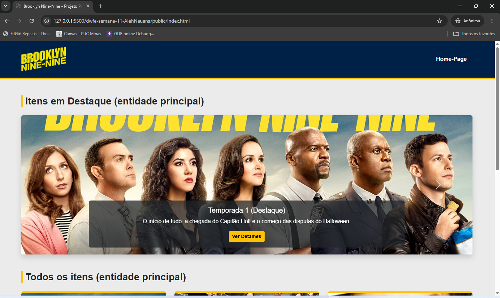
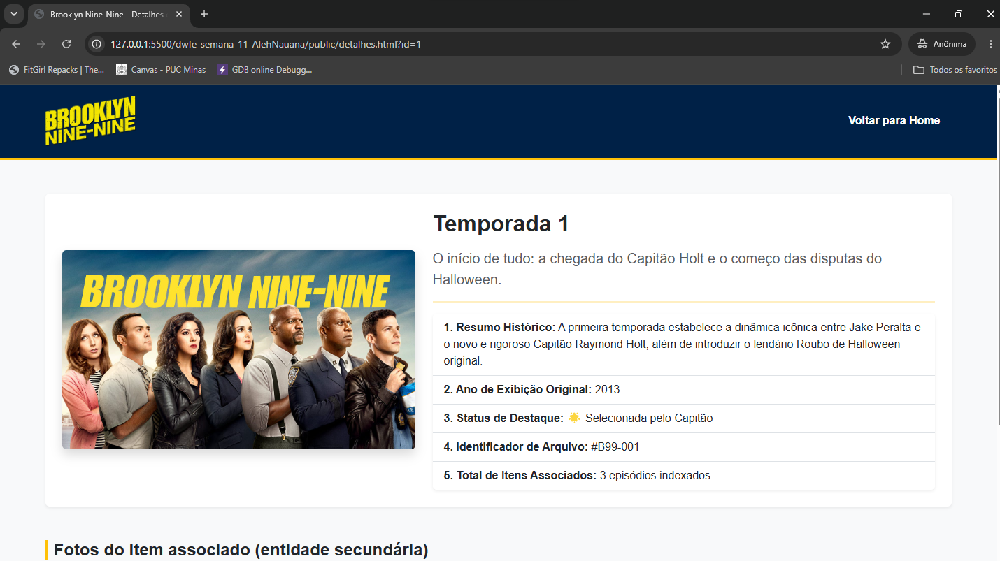

# Trabalho Prático - Semana 11

Nesta atividade, vamos evoluir o projeto em que estamos trabalhando nesse semestre, acrescentando a página de detalhes.

Imagine que a página principal (home-page) mostre um visão dos vários itens que existem no seu site. Ao clicar em um item, você é direcionado pra a página de detalhes. A página de detalhe vai mostrar todas as informações sobre o item do seu projeto, seja esse item uma notícia, filme, receita, lugar turístico ou evento.

## Informações Gerais

- Nome: Alexandra Nauna Gonçalves Faria
- Matricula: 927712
- Decreva brevemente seu projeto: A escolha foi voltada para criar um tipo de blog que fala sobre uma série de TV, no qual serão apresentadas curiosidades, informações sobre personagens e acontecimentos principais.

## Prints do trabalho

<< COLOQUE A IMAGEM - HOME-PAGE - AQUI >>


<< COLOQUE A IMAGEM - TELA DE DETALHES - AQUI >>


## Dados em JSON

Inclua aqui a estrutura de dados definida por você para o projeto com pelo menos dois exemplo de dados.

```json
{
  "temporadas": [
    {
      "id": 1,
      "nome": "Temporada 1",
      "descricao": "O início de tudo: a chegada do Capitão Holt e o começo das disputas do Halloween.",
      "conteudo": "A primeira temporada estabelece a dinâmica icônica entre Jake Peralta e o novo e rigoroso Capitão Raymond Holt, além de introduzir o lendário Roubo de Halloween original.",
      "ano_lancamento": "2013",
      "destaque": true,
      "imagem_principal": "imgs/temporada1.jpg"
    },
    {
      "id": 2,
      "nome": "Temporada 2",
      "descricao": "Jake lida com sentimentos por Amy e Holt enfrenta sua arqui-inimiga Madeline Wuntch.",
      "conteudo": "A temporada expande o universo com investigações profundas, o amadurecimento do esquadrão e o infame retorno do bandido Pontiac Bandit.",
      "ano_lancamento": "2014",
      "destaque": false,
      "imagem_principal": "imgs/temporada2.jpg"
    }
  ]
}
```
